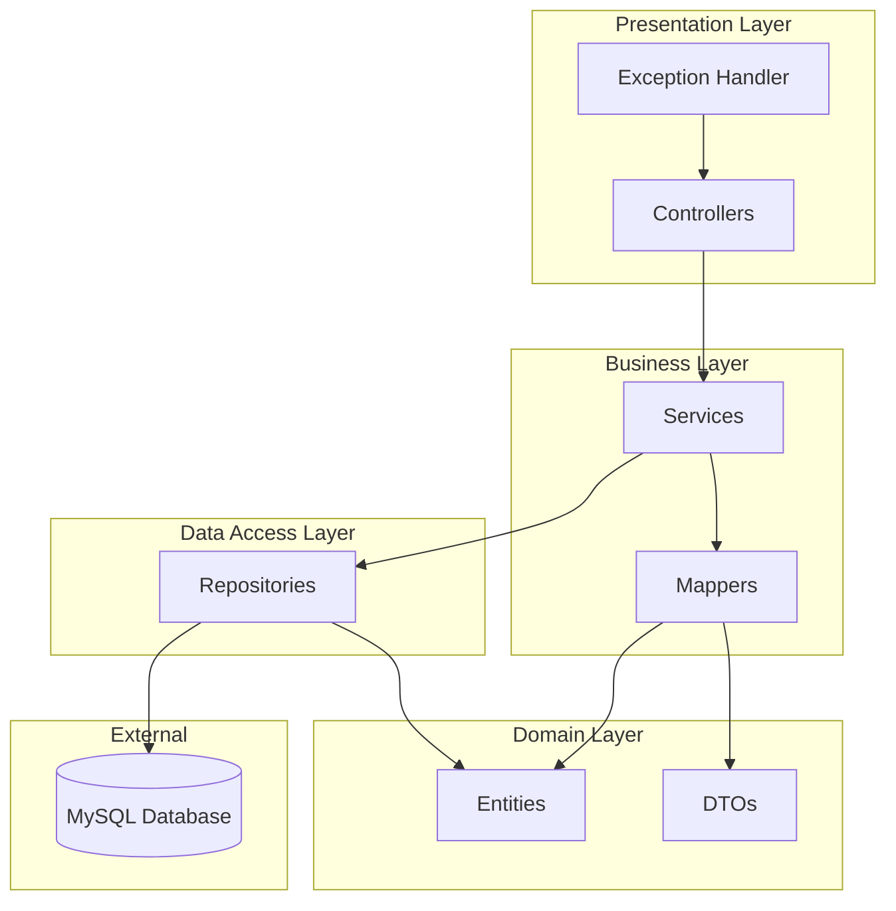
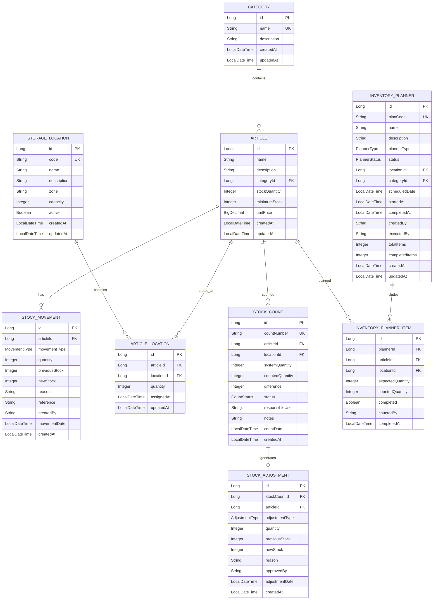
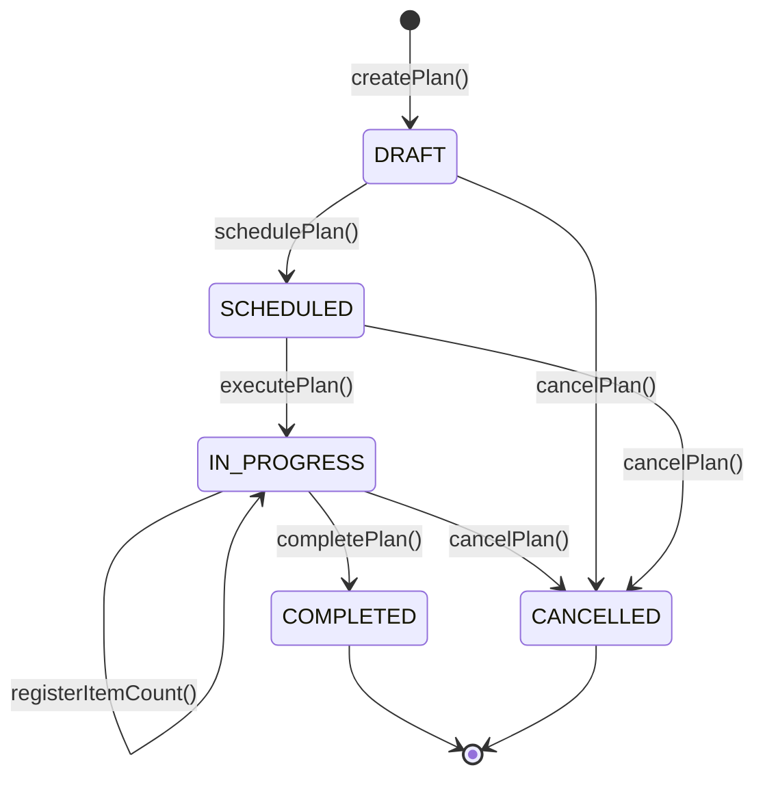

# Stock Management System - Implementation Plan

## Overview

A comprehensive **Stock Management System** built with Java Spring Boot following clean architecture principles, SOLID design, and RESTful API standards.

---

## 🎯 Requirements Compliance Matrix (100%)

> [!IMPORTANT]
> **Cada requerimiento funcional está explícitamente mapeado a entidades, servicios y endpoints.**

### Requerimientos Funcionales

| RF | Descripción | Entidad Principal | Servicio | Controller | Estado |
|----|-------------|-------------------|----------|------------|--------|
| **RF01** | Crear planificador de inventario | `InventoryPlanner` | `InventoryPlannerService.createPlan()` | `POST /api/v1/inventory-planners` | ✅ |
| **RF02** | Crear artículos | `Article`, `Category` | `ArticleService`, `CategoryService` | `ArticleController`, `CategoryController` | ✅ |
| **RF03** | Conteo de existencias y registro | `StockCount` | `StockCountService.createCount()` | `POST /api/v1/stock-counts` | ✅ |
| **RF04** | Crear ubicaciones | `StorageLocation` | `StorageLocationService` | `StorageLocationController` | ✅ |
| **RF05** | Ejecutar planificador | `InventoryPlanner` | `InventoryPlannerService.executePlan()` | `POST /api/v1/inventory-planners/{id}/execute` | ✅ |
| **RF06** | Registrar existencias (movimientos) | `StockMovement` | `StockMovementService` | `StockMovementController` | ✅ |
| **RF07** | Reportes de existencias | `StockReport` (DTO) | `ReportService.generateStockReport()` | `GET /api/v1/reports/stock` | ✅ |
| **RF08** | Registrar ubicación de artículo | `ArticleLocation` | `ArticleLocationService` | `ArticleLocationController` | ✅ |

### Requerimientos No Funcionales

| RNF | Descripción | Implementación | Estado |
|-----|-------------|----------------|--------|
| **RNF01** | Aplicación Web | Spring Boot REST API | ✅ |
| **RNF02** | Base de datos MySQL | Spring Data JPA + MySQL Connector | ✅ |
| **RNF03** | Despliegue Linux/Unix | JAR ejecutable, sin dependencias Windows | ✅ |
| **RNF04** | Cloud-ready | Stateless, configuración externalizada | ✅ |

---

## Architecture Design

### Layered Architecture



### Package Structure

```
com.stockmanagement
├── StockManagementApplication.java
├── config/
│   └── OpenApiConfig.java
├── controller/
│   ├── ArticleController.java
│   ├── CategoryController.java
│   ├── StockMovementController.java
│   ├── StorageLocationController.java
│   ├── ArticleLocationController.java
│   ├── StockCountController.java
│   ├── InventoryPlannerController.java
│   ├── ReportController.java
│   └── HealthController.java
├── dto/
│   ├── request/
│   │   ├── ArticleRequest.java
│   │   ├── CategoryRequest.java
│   │   ├── StockMovementRequest.java
│   │   ├── StorageLocationRequest.java
│   │   ├── ArticleLocationRequest.java
│   │   ├── StockCountRequest.java
│   │   ├── StockAdjustmentRequest.java
│   │   ├── InventoryPlannerRequest.java
│   │   ├── ExecutePlannerRequest.java
│   │   ├── PlannerItemCountRequest.java
│   │   └── ReportFilterRequest.java
│   └── response/
│       ├── ArticleResponse.java
│       ├── CategoryResponse.java
│       ├── StockMovementResponse.java
│       ├── StorageLocationResponse.java
│       ├── ArticleLocationResponse.java
│       ├── StockCountResponse.java
│       ├── StockAdjustmentResponse.java
│       ├── InventoryPlannerResponse.java
│       ├── InventoryPlannerItemResponse.java
│       ├── StockReportResponse.java
│       ├── MovementReportResponse.java
│       ├── LowStockAlertResponse.java
│       ├── ApiErrorResponse.java
│       └── PageResponse.java
├── entity/
│   ├── Article.java
│   ├── Category.java
│   ├── StockMovement.java
│   ├── StorageLocation.java
│   ├── ArticleLocation.java
│   ├── StockCount.java
│   ├── StockAdjustment.java
│   ├── InventoryPlanner.java
│   ├── InventoryPlannerItem.java
│   └── enums/
│       ├── MovementType.java
│       ├── CountStatus.java
│       ├── AdjustmentType.java
│       ├── PlannerType.java
│       └── PlannerStatus.java
├── exception/
│   ├── ResourceNotFoundException.java
│   ├── BusinessException.java
│   ├── InsufficientStockException.java
│   ├── DuplicateResourceException.java
│   ├── InvalidOperationException.java
│   └── GlobalExceptionHandler.java
├── mapper/
│   ├── ArticleMapper.java
│   ├── CategoryMapper.java
│   ├── StockMovementMapper.java
│   ├── StorageLocationMapper.java
│   ├── ArticleLocationMapper.java
│   ├── StockCountMapper.java
│   ├── StockAdjustmentMapper.java
│   ├── InventoryPlannerMapper.java
│   └── ReportMapper.java
├── repository/
│   ├── ArticleRepository.java
│   ├── CategoryRepository.java
│   ├── StockMovementRepository.java
│   ├── StorageLocationRepository.java
│   ├── ArticleLocationRepository.java
│   ├── StockCountRepository.java
│   ├── StockAdjustmentRepository.java
│   ├── InventoryPlannerRepository.java
│   └── InventoryPlannerItemRepository.java
└── service/
    ├── ArticleService.java
    ├── CategoryService.java
    ├── StockMovementService.java
    ├── StorageLocationService.java
    ├── ArticleLocationService.java
    ├── StockCountService.java
    ├── StockAdjustmentService.java
    ├── InventoryPlannerService.java
    ├── ReportService.java
    └── impl/
        ├── ArticleServiceImpl.java
        ├── CategoryServiceImpl.java
        ├── StockMovementServiceImpl.java
        ├── StorageLocationServiceImpl.java
        ├── ArticleLocationServiceImpl.java
        ├── StockCountServiceImpl.java
        ├── StockAdjustmentServiceImpl.java
        ├── InventoryPlannerServiceImpl.java
        └── ReportServiceImpl.java
```

---

## Entity Relationship Diagram



---

## RF01 - Crear Planificador de Inventario

> [!NOTE]
> El **Planificador de Inventario** es una entidad de primera clase que permite programar y organizar conteos de inventario.

### Entidad: `InventoryPlanner`

```java
@Entity
@Table(name = "inventory_planners")
public class InventoryPlanner {
    @Id @GeneratedValue(strategy = IDENTITY)
    private Long id;
    
    @Column(unique = true, nullable = false)
    private String planCode;  // Auto-generado: "PLAN-2026-0001"
    
    @Column(nullable = false)
    private String name;  // "Conteo Trimestral Q1 2026"
    
    private String description;
    
    @Enumerated(EnumType.STRING)
    private PlannerType plannerType;  // FULL, BY_CATEGORY, BY_LOCATION, BY_ARTICLES
    
    @Enumerated(EnumType.STRING)
    private PlannerStatus status;  // DRAFT, SCHEDULED, IN_PROGRESS, COMPLETED, CANCELLED
    
    private LocalDateTime scheduledDate;
    private LocalDateTime startedAt;
    private LocalDateTime completedAt;
    
    private String createdBy;
    private String executedBy;
    
    private Integer totalItems = 0;
    private Integer completedItems = 0;
    
    @OneToMany(mappedBy = "inventoryPlanner", cascade = ALL)
    private List<InventoryPlannerItem> items;
    
    @ManyToOne
    private StorageLocation location;  // Opcional, para BY_LOCATION
    
    @ManyToOne
    private Category category;  // Opcional, para BY_CATEGORY
}
```

### Servicio: `InventoryPlannerService`

```java
public interface InventoryPlannerService {
    // RF01 - CREAR PLANIFICADOR
    InventoryPlannerResponse createPlan(InventoryPlannerRequest request);
    
    // Genera automáticamente:
    // - planCode único (PLAN-YYYY-####)
    // - Items según plannerType:
    //   * FULL_INVENTORY: todos los artículos
    //   * BY_CATEGORY: artículos de la categoría
    //   * BY_LOCATION: artículos en la ubicación
    //   * BY_ARTICLES: artículos específicos (IDs en request)
    // - Estado inicial: DRAFT o SCHEDULED
    
    InventoryPlannerResponse updatePlan(Long id, InventoryPlannerRequest request);
    void deletePlan(Long id);
    InventoryPlannerResponse findById(Long id);
    Page<InventoryPlannerResponse> findAll(Pageable pageable);
    List<InventoryPlannerResponse> findByStatus(PlannerStatus status);
}
```

### Endpoint: `POST /api/v1/inventory-planners`

**Request:**
```json
{
    "name": "Conteo Trimestral Q1 2026",
    "description": "Conteo completo de inventario primer trimestre",
    "plannerType": "FULL_INVENTORY",
    "scheduledDate": "2026-03-31T08:00:00",
    "createdBy": "admin"
}
```

**Response (201 Created):**
```json
{
    "id": 1,
    "planCode": "PLAN-2026-0001",
    "name": "Conteo Trimestral Q1 2026",
    "description": "Conteo completo de inventario primer trimestre",
    "plannerType": "FULL_INVENTORY",
    "status": "SCHEDULED",
    "scheduledDate": "2026-03-31T08:00:00",
    "createdBy": "admin",
    "totalItems": 150,
    "completedItems": 0,
    "progressPercentage": 0.0,
    "createdAt": "2026-02-04T09:00:00"
}
```

---

## RF02 - Crear Artículos

> [!NOTE]
> CRUD completo de artículos con categorización.

### Entidad: `Article`

```java
@Entity
@Table(name = "articles", indexes = {
    @Index(name = "idx_article_name", columnList = "name"),
    @Index(name = "idx_article_category", columnList = "category_id")
})
public class Article {
    @Id @GeneratedValue(strategy = IDENTITY)
    private Long id;
    
    @Column(nullable = false)
    private String name;
    
    @Column(length = 1000)
    private String description;
    
    @ManyToOne(fetch = LAZY)
    @JoinColumn(name = "category_id", nullable = false)
    private Category category;
    
    @Column(nullable = false)
    private Integer stockQuantity = 0;
    
    @Column(nullable = false)
    private Integer minimumStock = 0;
    
    @Column(precision = 10, scale = 2)
    private BigDecimal unitPrice;
    
    private LocalDateTime createdAt;
    private LocalDateTime updatedAt;
    
    @OneToMany(mappedBy = "article")
    private List<StockMovement> movements;
    
    @OneToMany(mappedBy = "article")
    private List<ArticleLocation> locations;
}
```

### Endpoints

| Método | Endpoint | Descripción |
|--------|----------|-------------|
| GET | `/api/v1/articles` | Listar artículos (paginado) |
| GET | `/api/v1/articles/{id}` | Obtener artículo por ID |
| POST | `/api/v1/articles` | **Crear artículo** |
| PUT | `/api/v1/articles/{id}` | Actualizar artículo |
| DELETE | `/api/v1/articles/{id}` | Eliminar artículo |
| GET | `/api/v1/articles/low-stock` | Artículos con stock bajo |
| GET | `/api/v1/articles/category/{categoryId}` | Artículos por categoría |

---

## RF03 - Conteo de Existencias y Registro

> [!IMPORTANT]
> El conteo de existencias es un **evento formal registrado** con fecha, responsable, diferencia detectada, y posibilidad de ajuste posterior.

### Entidad: `StockCount`

```java
@Entity
@Table(name = "stock_counts")
public class StockCount {
    @Id @GeneratedValue(strategy = IDENTITY)
    private Long id;
    
    @Column(unique = true, nullable = false)
    private String countNumber;  // Auto-generado: "CNT-2026-0001"
    
    @ManyToOne(fetch = LAZY)
    @JoinColumn(name = "article_id", nullable = false)
    private Article article;
    
    @ManyToOne(fetch = LAZY)
    @JoinColumn(name = "location_id")
    private StorageLocation location;  // Opcional
    
    // CAPTURADO AL MOMENTO DEL CONTEO
    @Column(nullable = false)
    private Integer systemQuantity;  // Stock en sistema
    
    // INGRESADO POR EL USUARIO
    @Column(nullable = false)
    private Integer countedQuantity;  // Cantidad física contada
    
    // CALCULADO AUTOMÁTICAMENTE
    @Column(nullable = false)
    private Integer difference;  // = countedQuantity - systemQuantity
    
    @Enumerated(EnumType.STRING)
    private CountStatus status;  // PENDING, COMPLETED, ADJUSTED
    
    // RESPONSABLE DEL CONTEO
    @Column(nullable = false)
    private String responsibleUser;
    
    @Column(length = 500)
    private String notes;  // Observaciones
    
    // FECHA DEL CONTEO
    @Column(nullable = false)
    private LocalDateTime countDate;
    
    private LocalDateTime createdAt;
    
    @OneToOne(mappedBy = "stockCount")
    private StockAdjustment adjustment;  // Ajuste posterior
}
```

### Entidad: `StockAdjustment`

```java
@Entity
@Table(name = "stock_adjustments")
public class StockAdjustment {
    @Id @GeneratedValue(strategy = IDENTITY)
    private Long id;
    
    @OneToOne(fetch = LAZY)
    @JoinColumn(name = "stock_count_id", nullable = false)
    private StockCount stockCount;  // Conteo que originó el ajuste
    
    @ManyToOne(fetch = LAZY)
    @JoinColumn(name = "article_id", nullable = false)
    private Article article;
    
    @Enumerated(EnumType.STRING)
    private AdjustmentType adjustmentType;  // INCREASE, DECREASE
    
    private Integer quantity;
    private Integer previousStock;
    private Integer newStock;
    
    @Column(length = 500)
    private String reason;
    
    private String approvedBy;  // Quien aprueba el ajuste
    
    private LocalDateTime adjustmentDate;
    private LocalDateTime createdAt;
}
```

### Servicio: `StockCountService`

```java
public interface StockCountService {
    // RF03 - CREAR CONTEO DE EXISTENCIAS
    StockCountResponse createCount(StockCountRequest request);
    
    // El servicio:
    // 1. Captura systemQuantity del artículo en ese momento
    // 2. Calcula difference = countedQuantity - systemQuantity
    // 3. Registra fecha, responsable, observaciones
    // 4. Genera countNumber único
    
    StockCountResponse findById(Long id);
    Page<StockCountResponse> findAll(Pageable pageable);
    List<StockCountResponse> findByArticle(Long articleId);
    List<StockCountResponse> findByResponsible(String user);
    List<StockCountResponse> findByDateRange(LocalDateTime start, LocalDateTime end);
    List<StockCountResponse> findWithDifferences();  // Solo conteos con diferencias
}

public interface StockAdjustmentService {
    // Crear ajuste desde un conteo
    StockAdjustmentResponse createFromCount(Long countId, StockAdjustmentRequest request);
    
    // El servicio:
    // 1. Actualiza el stock del artículo
    // 2. Crea un StockMovement de tipo ADJUSTMENT
    // 3. Marca el StockCount como ADJUSTED
}
```

### Endpoint: `POST /api/v1/stock-counts`

**Request:**
```json
{
    "articleId": 1,
    "locationId": 2,
    "countedQuantity": 47,
    "responsibleUser": "juan.perez",
    "notes": "Conteo trimestral - 3 unidades dañadas encontradas"
}
```

**Response (201 Created):**
```json
{
    "id": 1,
    "countNumber": "CNT-2026-0001",
    "article": {
        "id": 1,
        "name": "Laptop Dell XPS 15"
    },
    "location": {
        "id": 2,
        "code": "ALM-A-01",
        "name": "Almacén A - Sección 1"
    },
    "systemQuantity": 50,
    "countedQuantity": 47,
    "difference": -3,
    "status": "COMPLETED",
    "responsibleUser": "juan.perez",
    "notes": "Conteo trimestral - 3 unidades dañadas encontradas",
    "countDate": "2026-02-04T10:30:00",
    "hasAdjustment": false
}
```

---

## RF04 - Crear Ubicaciones

> [!NOTE]
> Gestión de ubicaciones de almacenamiento.

### Entidad: `StorageLocation`

```java
@Entity
@Table(name = "storage_locations")
public class StorageLocation {
    @Id @GeneratedValue(strategy = IDENTITY)
    private Long id;
    
    @Column(unique = true, nullable = false)
    private String code;  // "ALM-A-01"
    
    @Column(nullable = false)
    private String name;  // "Almacén A - Sección 1"
    
    private String description;
    private String zone;  // "Zona Norte"
    private Integer capacity;
    private Boolean active = true;
    
    private LocalDateTime createdAt;
    private LocalDateTime updatedAt;
    
    @OneToMany(mappedBy = "storageLocation")
    private List<ArticleLocation> articleLocations;
}
```

### Endpoints

| Método | Endpoint | Descripción |
|--------|----------|-------------|
| GET | `/api/v1/locations` | Listar ubicaciones |
| GET | `/api/v1/locations/{id}` | Obtener ubicación por ID |
| POST | `/api/v1/locations` | **Crear ubicación** |
| PUT | `/api/v1/locations/{id}` | Actualizar ubicación |
| DELETE | `/api/v1/locations/{id}` | Eliminar ubicación |
| PATCH | `/api/v1/locations/{id}/activate` | Activar ubicación |
| PATCH | `/api/v1/locations/{id}/deactivate` | Desactivar ubicación |

---

## RF05 - Ejecutar Planificador

> [!IMPORTANT]
> El planificador creado en RF01 puede ser **ejecutado** para iniciar el proceso de conteo.

### Servicio: `InventoryPlannerService` (continuación)

```java
public interface InventoryPlannerService {
    // ... métodos de RF01 ...
    
    // RF05 - EJECUTAR PLANIFICADOR
    InventoryPlannerResponse executePlan(Long planId, ExecutePlannerRequest request);
    
    // El servicio:
    // 1. Cambia estado de SCHEDULED a IN_PROGRESS
    // 2. Registra executedBy y startedAt
    // 3. Para cada item, captura expectedQuantity (stock actual)
    // 4. Habilita el registro de conteos por item
    
    // Registrar conteo de un item específico
    InventoryPlannerItemResponse registerItemCount(Long planId, Long itemId, PlannerItemCountRequest request);
    
    // El servicio:
    // 1. Registra countedQuantity para el item
    // 2. Marca item como completed
    // 3. Actualiza completedItems del plan
    // 4. Opcionalmente crea StockCount si hay diferencia
    
    // Completar plan
    InventoryPlannerResponse completePlan(Long planId);
    
    // El servicio:
    // 1. Valida que todos los items estén completos
    // 2. Cambia estado a COMPLETED
    // 3. Registra completedAt
    // 4. Genera StockCounts para items con diferencias
    
    // Cancelar plan
    InventoryPlannerResponse cancelPlan(Long planId, String reason);
    
    // Obtener progreso
    Map<String, Object> getPlanProgress(Long planId);
}
```

### Endpoint: `POST /api/v1/inventory-planners/{id}/execute`

**Request:**
```json
{
    "executedBy": "supervisor.almacen"
}
```

**Response (200 OK):**
```json
{
    "id": 1,
    "planCode": "PLAN-2026-0001",
    "name": "Conteo Trimestral Q1 2026",
    "status": "IN_PROGRESS",
    "startedAt": "2026-03-31T08:00:00",
    "executedBy": "supervisor.almacen",
    "totalItems": 150,
    "completedItems": 0,
    "progressPercentage": 0.0,
    "items": [
        {
            "id": 1,
            "article": { "id": 1, "name": "Laptop Dell XPS 15" },
            "location": { "id": 2, "code": "ALM-A-01" },
            "expectedQuantity": 50,
            "countedQuantity": null,
            "completed": false
        }
    ]
}
```

### Flujo completo del Planificador



---

## RF06 - Registrar Existencias (Movimientos)

> [!NOTE]
> Registro de entradas y salidas de stock con actualización automática.

### Entidad: `StockMovement`

```java
@Entity
@Table(name = "stock_movements")
public class StockMovement {
    @Id @GeneratedValue(strategy = IDENTITY)
    private Long id;
    
    @ManyToOne(fetch = LAZY)
    @JoinColumn(name = "article_id", nullable = false)
    private Article article;
    
    @Enumerated(EnumType.STRING)
    private MovementType movementType;  // INCOMING, OUTGOING, ADJUSTMENT
    
    @Column(nullable = false)
    private Integer quantity;
    
    private Integer previousStock;
    private Integer newStock;
    
    @Column(length = 500)
    private String reason;
    
    private String reference;  // Número de orden, factura, etc.
    private String createdBy;
    
    private LocalDateTime movementDate;
    private LocalDateTime createdAt;
}
```

### Servicio: `StockMovementService`

```java
public interface StockMovementService {
    // Registrar entrada de stock
    StockMovementResponse registerIncoming(StockMovementRequest request);
    // Actualiza: article.stockQuantity += quantity
    
    // Registrar salida de stock
    StockMovementResponse registerOutgoing(StockMovementRequest request);
    // Valida stock suficiente
    // Actualiza: article.stockQuantity -= quantity
    
    // Registrar ajuste (interno, desde StockAdjustment)
    StockMovementResponse registerAdjustment(Long articleId, Integer quantity, String reason);
    
    List<StockMovementResponse> findByArticle(Long articleId);
    Page<StockMovementResponse> findAll(Pageable pageable);
}
```

### Endpoints

| Método | Endpoint | Descripción |
|--------|----------|-------------|
| POST | `/api/v1/stock-movements/incoming` | **Registrar entrada** |
| POST | `/api/v1/stock-movements/outgoing` | **Registrar salida** |
| GET | `/api/v1/stock-movements` | Listar movimientos |
| GET | `/api/v1/stock-movements/article/{id}` | Movimientos por artículo |

---

## RF07 - Reportes de Existencias

> [!IMPORTANT]
> Reportes **consolidados** con información agregada, no solo listados de datos.

### Servicio: `ReportService`

```java
public interface ReportService {
    // REPORTE DE EXISTENCIAS CONSOLIDADO
    StockReportResponse generateStockReport(ReportFilterRequest filter);
    
    // Incluye:
    // - Fecha del reporte
    // - Filtros aplicados
    // - Resumen: totalArticulos, totalUnidades, valorTotal, articulosBajoMinimo
    // - Agrupación por categoría
    // - Lista de artículos con alertas de stock bajo
    // - Detalle de artículos (opcional)
    
    // REPORTE DE MOVIMIENTOS
    MovementReportResponse generateMovementReport(ReportFilterRequest filter);
    
    // Incluye:
    // - Período del reporte
    // - Total entradas, total salidas, total ajustes
    // - Agrupación por tipo de movimiento
    // - Historial de movimientos
    
    // ALERTAS DE STOCK BAJO
    LowStockAlertResponse generateLowStockAlerts();
    
    // Incluye:
    // - Lista de artículos con stock < minimumStock
    // - Déficit por artículo
    // - Última entrada registrada
    // - Días sin reposición
    
    // REPORTE DE INVENTARIO POR UBICACIÓN
    LocationInventoryReportResponse generateLocationInventoryReport(Long locationId);
    
    // REPORTE DE VALORIZACIÓN
    ValuationReportResponse generateValuationReport(ReportFilterRequest filter);
}
```

### DTO: `StockReportResponse`

```java
public class StockReportResponse {
    private LocalDateTime reportDate;
    private ReportFilterApplied filterApplied;
    
    private ReportSummary summary;
    // totalArticles, totalQuantity, totalValue, articlesLowStock, articlesOutOfStock
    
    private List<CategorySummary> byCategory;
    // categoryId, categoryName, articleCount, totalQuantity, totalValue
    
    private List<LowStockItem> lowStockItems;
    // articleId, articleName, currentStock, minimumStock, deficit
    
    private List<ArticleStockDetail> articles;  // Opcional, paginado
}
```

### Endpoints

| Método | Endpoint | Descripción |
|--------|----------|-------------|
| GET | `/api/v1/reports/stock` | **Reporte de existencias consolidado** |
| GET | `/api/v1/reports/movements` | Reporte de movimientos |
| GET | `/api/v1/reports/low-stock-alerts` | Alertas de stock bajo |
| GET | `/api/v1/reports/locations/{id}` | Inventario por ubicación |
| GET | `/api/v1/reports/valuation` | Valorización de inventario |

### Ejemplo: Reporte de Existencias

**Request:**
```
GET /api/v1/reports/stock?categoryId=1&startDate=2026-01-01&endDate=2026-02-04
```

**Response (200 OK):**
```json
{
    "reportDate": "2026-02-04T11:00:00",
    "reportTitle": "Reporte de Existencias",
    "filterApplied": {
        "categoryId": 1,
        "categoryName": "Electrónicos",
        "startDate": "2026-01-01",
        "endDate": "2026-02-04"
    },
    "summary": {
        "totalArticles": 25,
        "totalQuantity": 1250,
        "totalValue": 156789.50,
        "articlesLowStock": 3,
        "articlesOutOfStock": 1
    },
    "byCategory": [
        {
            "categoryId": 1,
            "categoryName": "Electrónicos",
            "articleCount": 25,
            "totalQuantity": 1250,
            "totalValue": 156789.50,
            "percentageOfTotal": 100.0
        }
    ],
    "lowStockItems": [
        {
            "articleId": 5,
            "articleName": "Cable USB-C",
            "currentStock": 8,
            "minimumStock": 20,
            "deficit": 12,
            "status": "CRITICAL"
        }
    ],
    "generatedBy": "Sistema",
    "generatedAt": "2026-02-04T11:00:00"
}
```

---

## RF08 - Registrar Ubicación de Artículo

> [!NOTE]
> Asignación de artículos a ubicaciones de almacenamiento.

### Entidad: `ArticleLocation`

```java
@Entity
@Table(name = "article_locations",
    uniqueConstraints = @UniqueConstraint(columnNames = {"article_id", "location_id"}))
public class ArticleLocation {
    @Id @GeneratedValue(strategy = IDENTITY)
    private Long id;
    
    @ManyToOne(fetch = LAZY)
    @JoinColumn(name = "article_id", nullable = false)
    private Article article;
    
    @ManyToOne(fetch = LAZY)
    @JoinColumn(name = "location_id", nullable = false)
    private StorageLocation storageLocation;
    
    @Column(nullable = false)
    private Integer quantity;
    
    private LocalDateTime assignedAt;
    private LocalDateTime updatedAt;
}
```

### Endpoints

| Método | Endpoint | Descripción |
|--------|----------|-------------|
| POST | `/api/v1/article-locations` | **Asignar artículo a ubicación** |
| GET | `/api/v1/article-locations/article/{id}` | Ubicaciones de un artículo |
| GET | `/api/v1/article-locations/location/{id}` | Artículos en una ubicación |
| PUT | `/api/v1/article-locations/{id}` | Actualizar cantidad |
| DELETE | `/api/v1/article-locations/{id}` | Eliminar asignación |
| POST | `/api/v1/article-locations/transfer` | Transferir entre ubicaciones |

---

## Exception Handling

### Custom Exceptions

| Exception | HTTP Status | Uso |
|-----------|-------------|-----|
| `ResourceNotFoundException` | 404 | Entidad no encontrada |
| `BusinessException` | 400 | Violación de regla de negocio |
| `InsufficientStockException` | 400 | Stock insuficiente para operación |
| `DuplicateResourceException` | 409 | Violación de unicidad |
| `InvalidOperationException` | 400 | Transición de estado inválida |

### GlobalExceptionHandler

```java
@RestControllerAdvice
public class GlobalExceptionHandler {
    
    @ExceptionHandler(ResourceNotFoundException.class)
    public ResponseEntity<ApiErrorResponse> handleNotFound(ResourceNotFoundException ex) {
        return ResponseEntity.status(404).body(new ApiErrorResponse(
            404, "NOT_FOUND", ex.getMessage(), LocalDateTime.now()
        ));
    }
    
    @ExceptionHandler(MethodArgumentNotValidException.class)
    public ResponseEntity<ApiErrorResponse> handleValidation(MethodArgumentNotValidException ex) {
        // Retorna errores de validación con detalle por campo
    }
    
    // ... otros handlers
}
```

### ApiErrorResponse

```json
{
    "status": 404,
    "error": "NOT_FOUND",
    "message": "Article not found with id: 999",
    "timestamp": "2026-02-04T12:00:00",
    "path": "/api/v1/articles/999",
    "details": []
}
```

---

## Verification Plan

### Automated Tests

```bash
# 1. Compilar proyecto
mvn clean compile

# 2. Ejecutar aplicación
mvn spring-boot:run

# 3. Verificar health check
curl http://localhost:8080/api/v1/health
```

### Manual Verification Checklist

- [ ] CRUD de categorías funciona
- [ ] CRUD de artículos funciona
- [ ] Movimientos de stock actualizan cantidades
- [ ] Conteo de existencias registra diferencias
- [ ] Ajustes modifican stock correctamente
- [ ] Planificador puede crearse y ejecutarse
- [ ] Reportes generan información consolidada
- [ ] Ubicaciones pueden asignarse a artículos

---

## Design Decisions

1. **InventoryPlanner como Entidad de Primera Clase**: Permite programar, ejecutar y dar seguimiento a procesos de inventario con estados definidos.

2. **StockCount con Registro Formal**: Captura estado del sistema al momento del conteo, responsable, fecha y diferencias para auditoría completa.

3. **Reportes como Servicio Dedicado**: `ReportService` genera reportes consolidados con agregaciones, no solo consultas de datos crudos.

4. **Separación StockCount/StockAdjustment**: El conteo y el ajuste son acciones separadas que pueden requerir aprobación diferente.

5. **Códigos Auto-generados**: `planCode` y `countNumber` proporcionan identificadores únicos legibles para referencia.

6. **Auditoría Completa**: Todos los movimientos registran estado anterior, nuevo, responsable y fecha.
